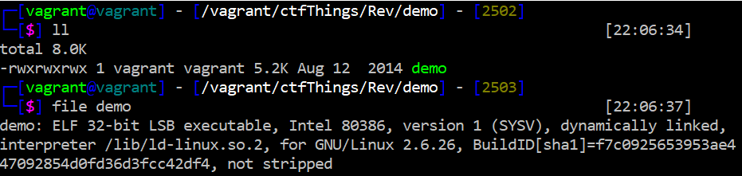
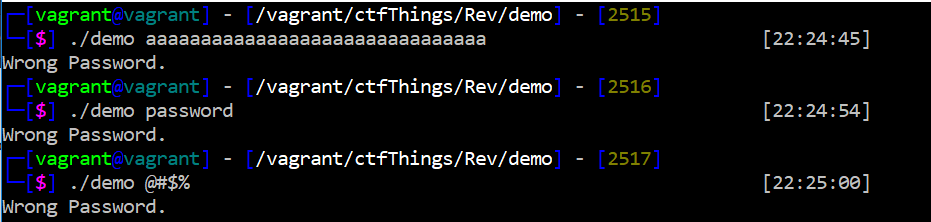
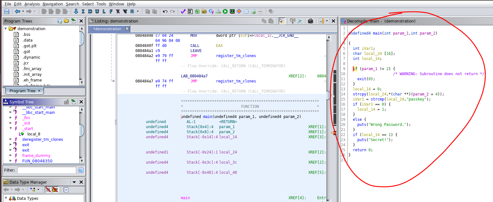
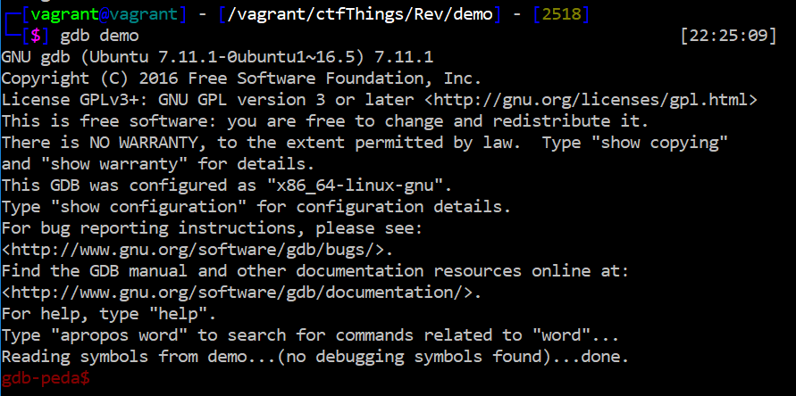
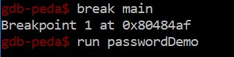
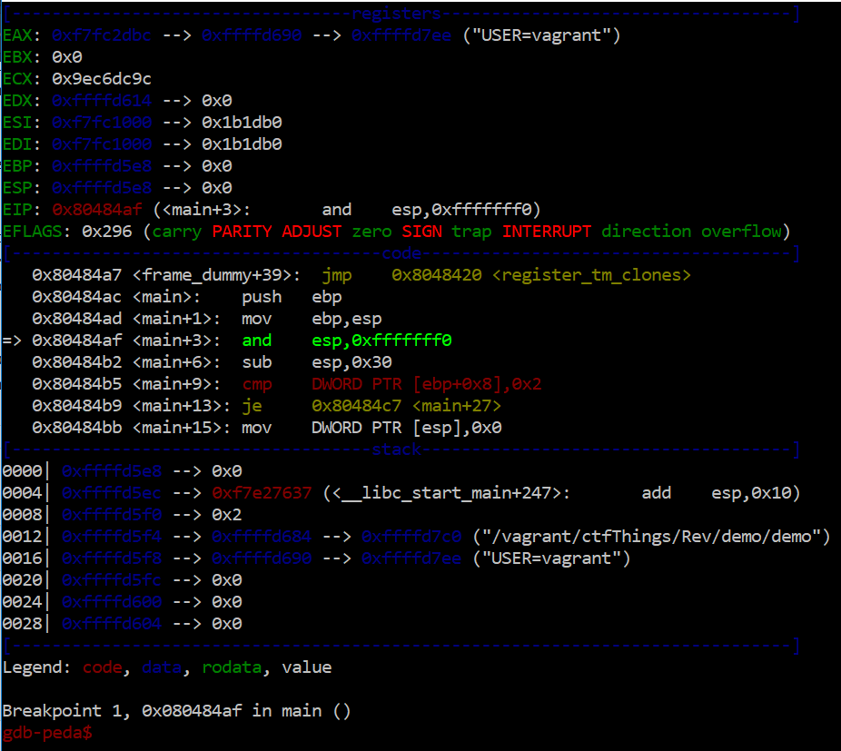
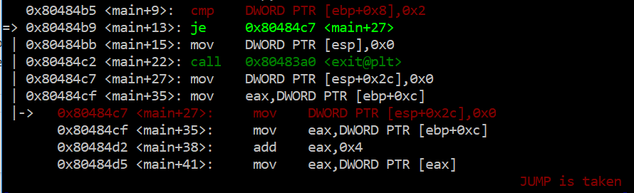
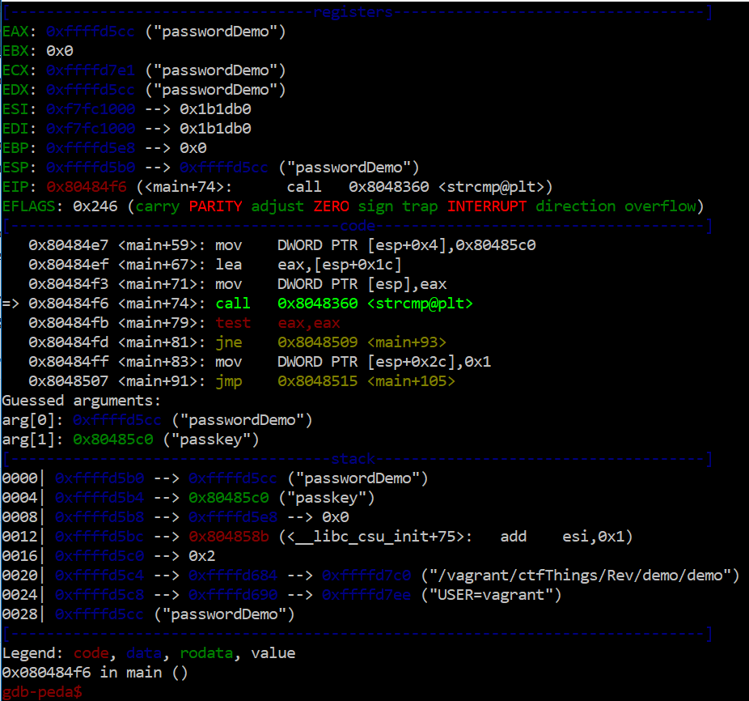

# Reverse Engineering Presentation
#### Presentation for Software Security course about Reverse Engineering

### Intro

This is a simple presentation of a basic C program which serves the simple purpose of taking a string as input, comparing it, and returning "Wrong Password!" if the string compare fails, or "Secret!" if the string compare succeeds. The binary used in the demo has been pushed into this repository, as well as the .c file.

### Tools

In this demo we will be using GDB inside a Vagrant box, as well as Ghidra inside an Ubuntu box.

### Demo

Here we have a binary called "demo". The first thing we're going to want to do would be to run file on this binary. simply type in ```file demo```
This gives us valuable information to keep in mind when analyzing the binary.</br> 

- First thing to note is that it is an ELF file, indicating that it's a normal linux executably. 
- 32 bit indicates that we are to expect arguments on the stack since it will not require registers like 64 bit.
- dinamically linked means the program is given the addresses to the library functions at runtime
- Not stripped which means the function names are still in it

Now that we know what to look out for, let's do some fuzzing on the binary to see what it's all about.</br>

After various inputs it is evident that this program takes in a string and compares it to some value in order to verify that it is the right password.

The approach is simple, first we statically analyze the code, then we dynamically analyze the code.

#### Static Analysis

First thing to do is to transfer the binary over to our Ubuntu box. We open Ghidra, start a new project, import the binary, and then go to the functions and click on main. This will open up the pseudo-code for the binary on the right panel and the assembly code on the left panel.</br>

As you can see, the pseudo-code is quite dead on for what we would expect. We see that the program takes in an argument, compares it to "passkey", and if the comparison is good it will set a local variable to 1 and we should be able to see the "Secret!"
 prompt.
 This already tells us that our passcode is "passkey". Fairly simple! We will now see what would happen when we decide to dynamically analyze the code. This is for the sake of demonstration as it is unlikely one would deal with such a simple program in the real world.
 
#### Dynamic Analysis
In order to dynamically analyze the code, we will use GDB with a Peda wrapper. In order to start gdb, we type in ```gdb demo``` which should return the following</br>
</br>
The first step is to set a breakpoint at main that way we can get to where the program starts executing the main function, hence the part where the actual code that was written will start. Before we run the program we also want to make sure we feed it some input. We'll give it "passwordDemo" as we already know that it is not the real password. This will let us see what logic the program has when it comes to the code.</br>
</br>
Once that is done, we should arrive at this screen. This is what GDB looks like with the Peda wrapper, it shows what values are in the registers, what the stepper is on in terms of the assembly code, and what values are stored in the stack.</br>
</br>
We will now type in ```ni``` to be able to step on to the differet instructions and see what logic routes happen when the program has out input. Hitting enter a few times takes us to a "cmp" instruction which makes sure that the file basically has input. Since this is correct, the program will jump over to where the comparisson in the passwords takes place.</br>
</br>
Moving a few instructions down, we get to a point where our password is loaded on to the "EAX" register moments before it is compared to another string. Moving a few instructions further down we finally get to the point where string compare is called.</br>
</br>
It is evident that the password our input is being compared to is "passKey" as it is show to be "arg[1]". This is later tested in the next instruction, and as expected the program tells us it is the wrong password and it exits. The dynamic analysis basically put to work teh static code we previously saw, and helps us test any theories we may have about what is correct and what is incorrect in order to get the outcome that we ultimately want.

#### Conclusion
Reverse Engineering is a fundamental step in computer security as it helps us understand how our programs can be broken and how we can fix them. It is evident here that it would not be smart to store a password in plainsight when it comes to writing a program. Additionally, there are preventative measures we can take against debuggers which are worth looking into and learning.
